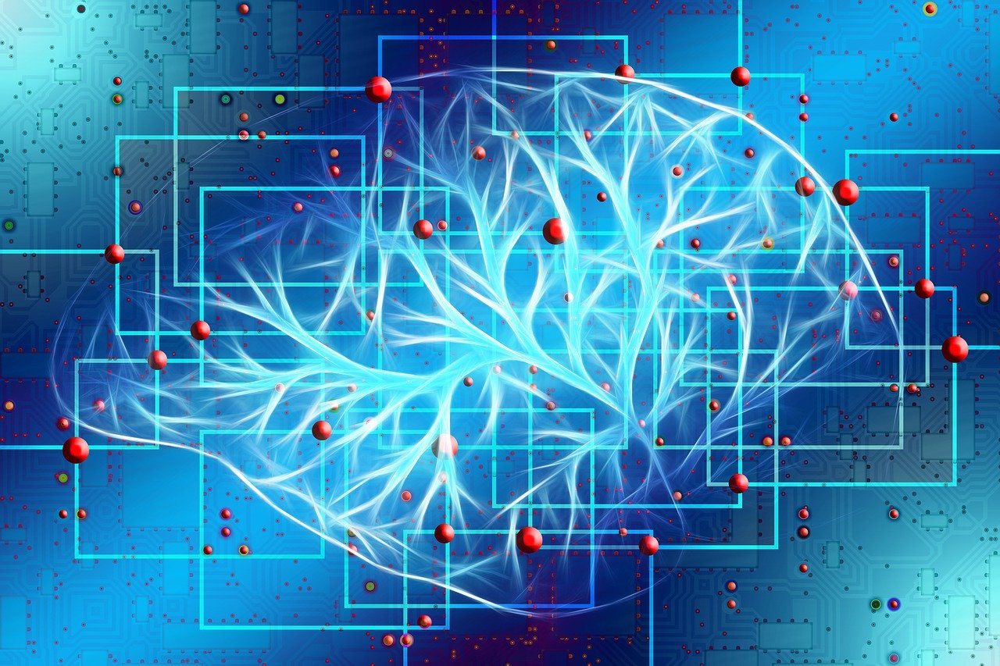

### AI: but how Does it Work?

_Texte translated from IAI Mooc._

Many artificial intelligence mechanisms today work through supervised learning. This mechanism resembles one of the ways in which a biological system learns.

Let's imagine that we want to teach an artificial intelligence to recognise a cat in an image.

To do this, we will provide a lot of data, namely, many images where a cat can be seen and many images where no cat can be seen, so that the calculation adjusts its parameters in order to give an output value corresponding to the presence or not of the feline. All these images constitute the input data, and the expected result, whether or not there is a cat in the image, the output data. These "input" and "output" data are the only information provided for its training.  
The computational mechanism must therefore adjust internal parameters (such as the control knobs of a camera) to determine whether or not there is a cat in the image. The first time, a random and therefore most likely false result will be provided, then little by little the mechanism will observe the errors and by successive trials will adjust the parameters to reduce them. This process is known as machine learning.

Image by Gerd Altmann from Pixabay

This mechanism of artificial neural networks is quite different from the neurons in our brain: they are just elementary computational units that combine input data and deliver a low or high value as output depending on the combined value. A neural network is a set of neurons that are all connected and communicate with each other. It is the parameters of these connections between neurons that constitute the control knobs to obtain the desired output for a given input. From the input neurons to the output neurons, via the neurons inside the network (hidden neurons), the digital information is transmitted to give a final result.

We speak of **deep learning** when there are many hidden layers stacked up to make the calculation more efficient.

We speak of **convolutional neural networks** when neurons gather information from other neurons in the vicinity before transmitting the output to higher layers. For example, when analysing an image, a convolutional neural network will create filters to group information from a small area of the image. For example, the contrast, or a colour element, and then at the next layer small areas corresponding to basic elements such as a line or a slightly round area, and little by little the mechanism recognises a cat as well as Jim Davis, it's amazing. But then, what reasoning has been put in place to distinguish between images with and without cats? Well, none! It's just a calculation, a blind calculation in a way. And we don't know how to interpret such a calculation today. This is what we call the black box of AI 2.

* * *
2References in French: _[Comprendre le DeepLearning et les Réseaux de neurones en 10 mins !](https://www.youtube.com/watch?v=gPVVsw2OWdM)_ vidéo, Sociamix, août 2019 - (Understanding deep learning and neural networks in 10 mins!)  
_[Le deep learning](https://www.youtube.com/watch?v=trWrEWfhTVg)_, vidéo, Science étonnante #27, avril 2016  
_[Comment le « deep learning » révolutionne l'intelligence artificielle](https://www.lemonde.fr/pixels/article/2015/07/24/comment-le-deep-learning-revolutionne-l-intelligence-artificielle_4695929_4408996.html)_ par Morgane Tual ; Le Monde, juillet 2015. \- (How Deep Learning transforms AI.)
