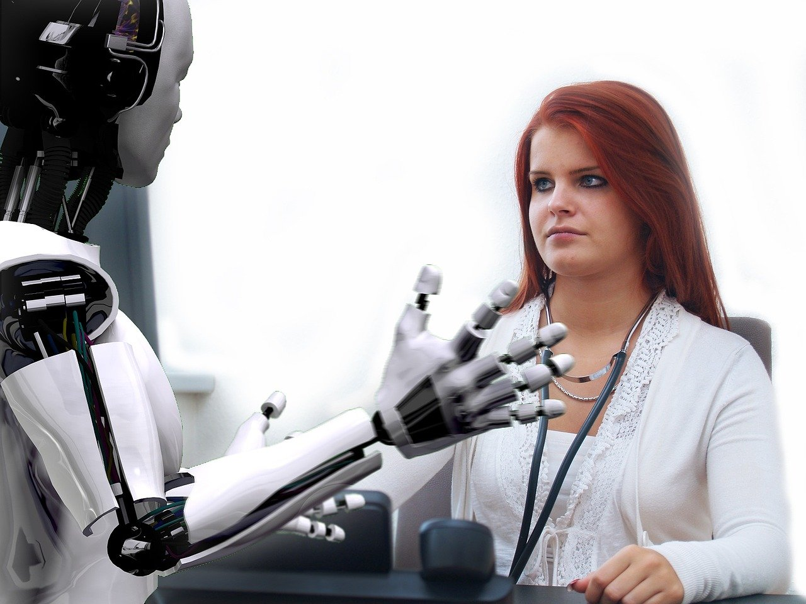

### A revolution that affects both blue and white collar workers

Previous industrial revolutions have always had an almost exclusive impact on the category of workers known as "**blue-collar workers**". That is, occupations involving rather manual tasks.

In contrast, the so-called "**white-collar workers**", those in "office" jobs, have never before been threatened by these revolutions. The technological revolution heralded by AI is in this respect very different from previous ones. It threatens both white and blue collar workers. In the list of jobs that will be most affected in the years to come, we find not only jobs such as train driving or counter work, but also in banking and insurance, in accounting, in office automation or in management.

In an interview with [Chut magazine](https://chut.media/portraits/erwann-tison-le-numerique-mon-emploi-et-moi/), Erwan Tison, director of studies at the Sapiens Institute, identifies in his book Robots, my job and me several job categories that, to different degrees, could be transformed by AI.

[Image by Thomas Meier](https://pixabay.com/users/tmeier1964-2034229/?utm_source=link-attribution&utm_medium=referral&utm_campaign=image&utm_content=1193318) for [Pixabay](https://pixabay.com/?utm_source=link-attribution&utm_medium=referral&utm_campaign=image&utm_content=1193318)

*   **"Physical"** jobs could be impacted by robotisation. Professionals would be replaced by machines that can perform difficult tasks faster and more efficiently than they can.

*   "**Intellectual**" jobs would be impacted by digitalisation. Algorithms could perform systematic, tedious and time-consuming tasks faster than humans.

*   Some professionals would see their daily lives improved by artificial intelligence mechanisms, which would allow them to be relieved of _repetitive tasks_ to focus on the most important aspects of their jobs.

*   Finally, some jobs, which require too much complex interaction with the environment, would not be directly threatened. This is the case for gardeners or plumbers, among others.

**Are these predictions likely and should we fear that we will eventually be mostly replaced by robots in our work?**

For the researcher and economist Gregory Verdugo _"Very poor indeed who can predict what will be technically automatable."_ We could seek to automate our entire society, but that would be our choice and we have to ask ourselves the question of the purpose of such a choice. For the moment, AI mainly allows us to **facilitate the work** of certain professionals, but in the future it will depend on how we collectively choose to organise society with these new Tools.

Image by [Seanbatty](https://pixabay.com/fr/users/Seanbatty-5097598/?utm_source=link-attribution&utm_medium=referral&utm_campaign=image&utm_content=2228610) from [Pixabay](https://pixabay.com/fr/?utm_source=link-attribution&utm_medium=referral&utm_campaign=image&utm_content=2228610)

Moreover, if artificial intelligence is capable of learning quickly, there are human capacities that can only be simulated and not realised, such as human empathy and creativity, for example. Yet in many professions, these two qualities are indispensable. A future where our nurses, artists or educators resemble R2D2 is therefore not yet possible.
