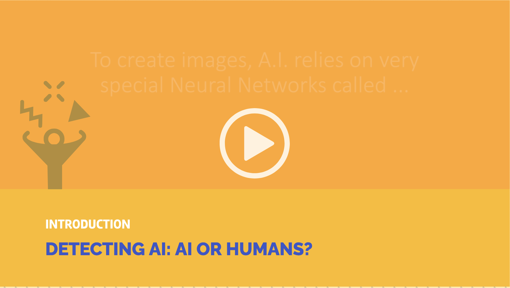

#### Let's Create with AI

>Créer et intégrer image du Tutorial3-ai4t

Detecting AI: AI or Human?

The following activity is about identifying whether an image is real or produced by an AI. This experimental activity is an introduction to understand GANs (Generative Adversarial Networks).

**Want to try?**  
_Click on the image below and let us guide you!_

{:target="_blank" }
