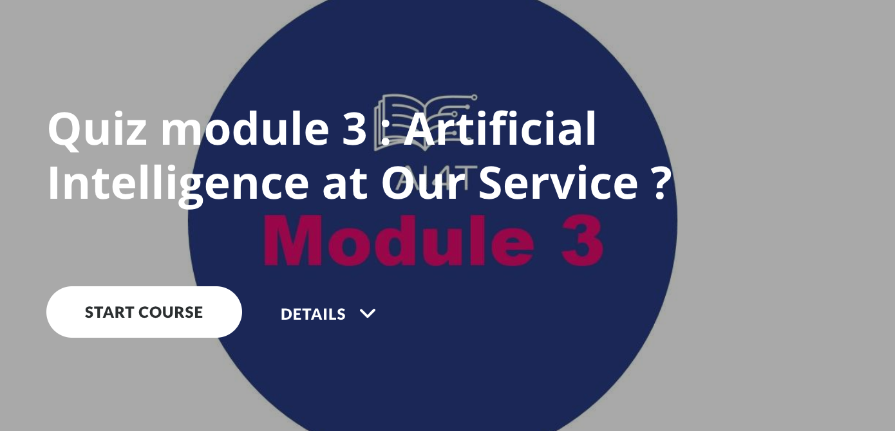

### Quiz Module 3: Humans and AI

Quiz Module 3 contains 3 parts:

- QUIZ 1: AI & Neural Networks
- QUIZ 2: Delegating Tasks to Algorithms
- QUIZ 3: Bias and Creativity

_Click on the image below and start the quiz!_

{:target="_blank" }
